<div align="center">
  

# herStoryWebSite

#### 用衣服，穿出屬於她的故事。

</div>

### 📜 內容

<details>
<summary>點我</summary>

- [herStoryWebSite](#herStoryWebSite) - [用衣服，穿出屬於她的故事。](#用衣服，穿出屬於她的故事。)
  - [📜 內容](#-內容)
  - [💡 摘要](#-摘要)
    - [👀 Live demo: https://herstory227.onrender.com/](#-live-demo-httpsherstory227-onrendercom)
    - [🧩 使用框架及套件](#-使用框架及套件)
  - [✨ 主要功能](#-主要功能)
    - [使用者頁面](#使用者頁面)
      - [登入註冊頁面](#登入註冊頁面)
      - [首頁](#首頁)
      - [全部商品頁](#全部商品頁)
    - [會員功能](#會員功能)
      - [購物車頁面](#購物車頁面)
      - [訂單頁面](#訂單頁面)
      - [個人資料](#個人資料)
    - [管理者頁面](#管理者頁面)
      - [商品管理](#商品管理)
        - [產品一覽](#產品一覽)
        - [庫存一覽](#庫存一覽)
        - [商品新增](#商品新增)
        - [庫存新增](#庫存新增)
      - [商家訂單管理](#商家訂單管理)
        - [詳細訂單](#詳細訂單)
      - [其他管理](#其他管理)
        - [顏色](#顏色)
        - [尺寸](#尺寸)
        - [支付方式](#支付方式)
        - [類別](#類別)
  - [🚀 執行本地專案](#-環境建置及安裝)
  - [💻 使用環境版本](#-使用環境版本)
    - [Core Technologies](#core-technologies)
    - [Packages](#packages)
    - [Development tools](#development-tools)
  - [🔒 License](#-license)

</details>

## 💡 摘要

本專案是一個小型的線上購物平台，提供了各種各樣的時尚、飾品、鞋子、手袋和其他女性相關商品的選擇。讓女性購物變得更加輕鬆、有趣和方便。

### 👀 Live demo: https://herstory227.onrender.com/

### 🧩 Built with

[](https://skillicons.dev)


## ✨ Features

### 使用者頁面

#### 登入註冊頁面

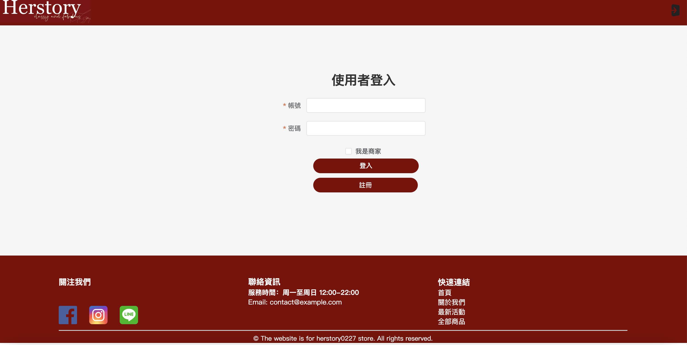

#### 首頁


#### 全部商品頁

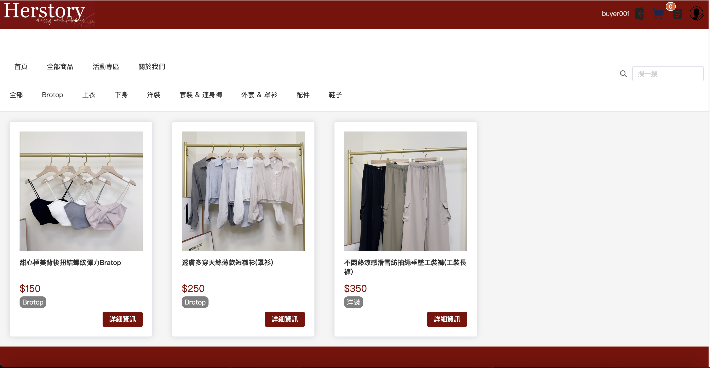

### 會員功能

#### 購物車頁面

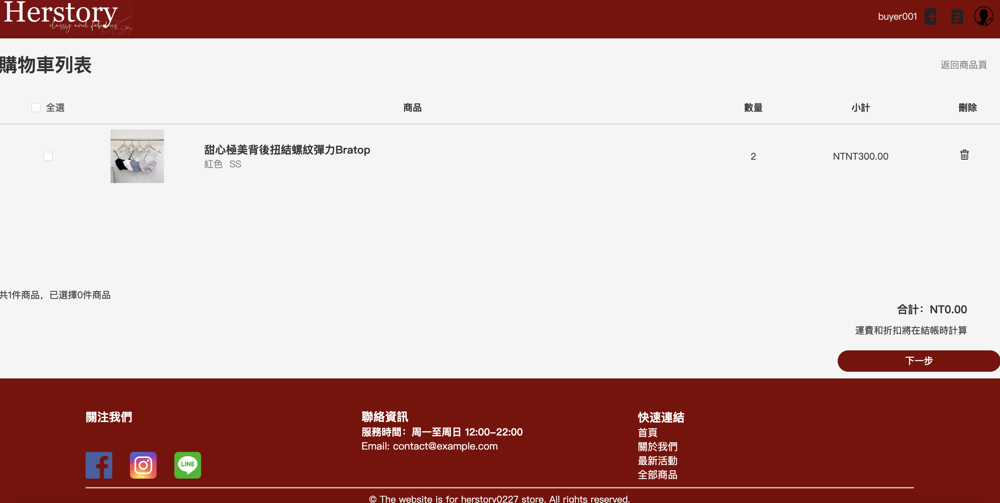

#### 訂單頁面

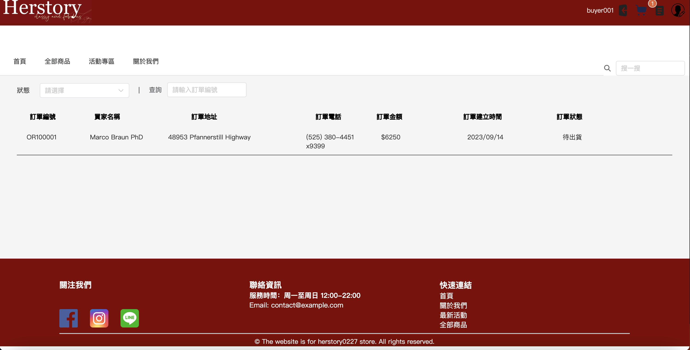

#### 個人資料

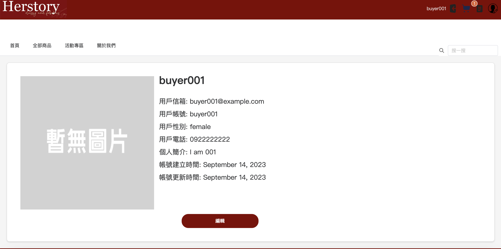

### 管理者頁面

#### 商品管理

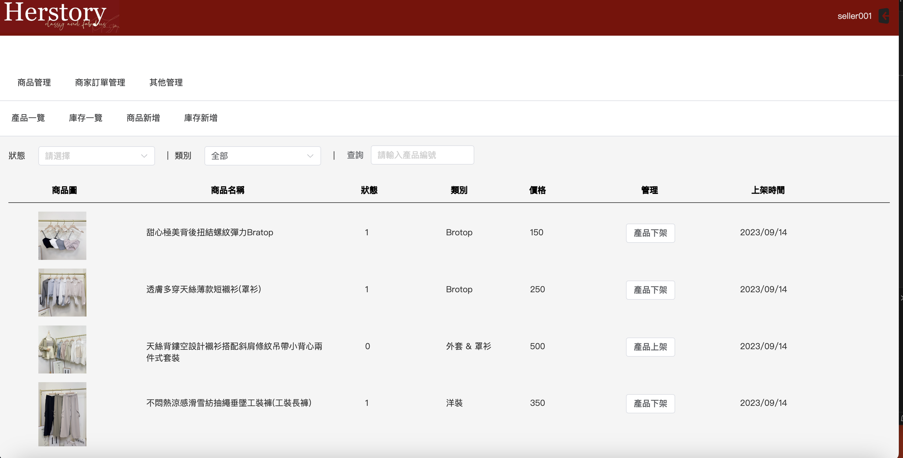

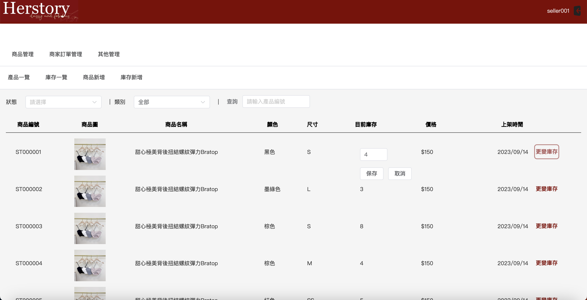

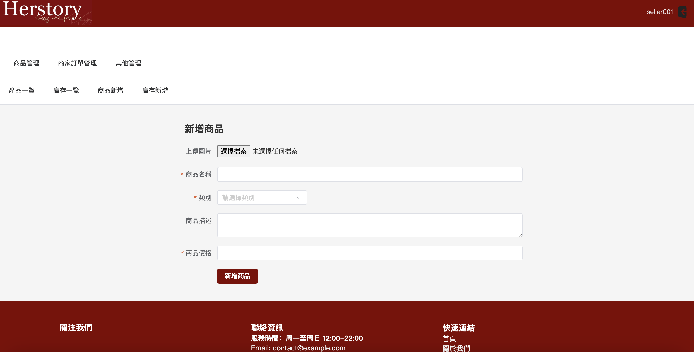

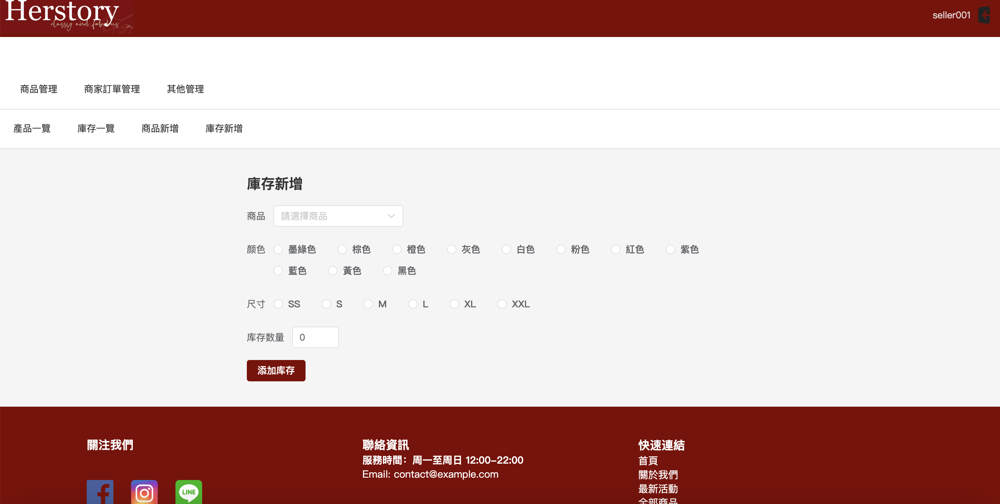

#### 商家訂單管理

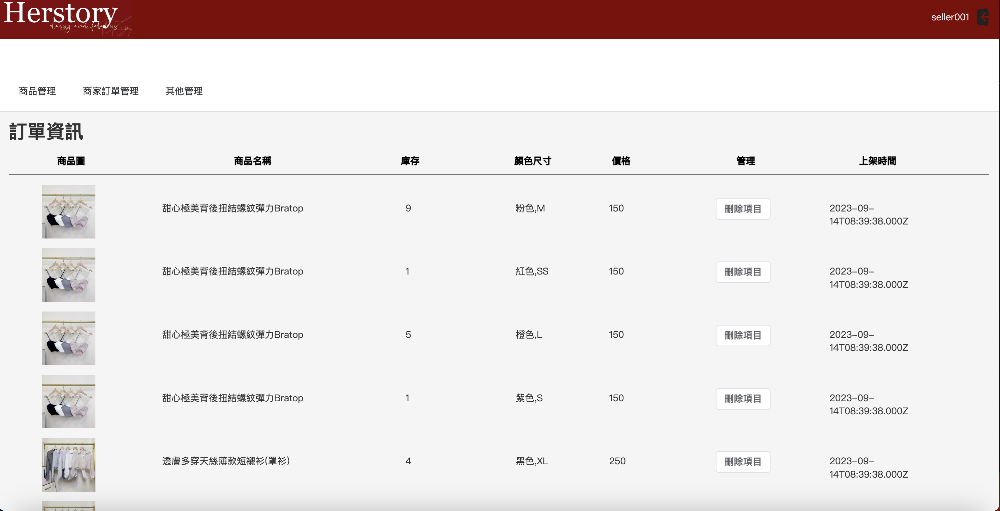

#### 其他管理

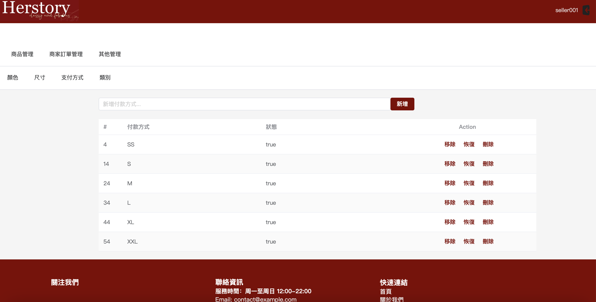


#### 🤔 待完成功能

- 金流串接
- 修改order訂單狀態（已出貨/未出貨）
- 購物畫面優化
- 管理者訂單刪除功能
- 篩選優化
- 全站搜尋功能

## 🚀 執行本地專案

1. 複製此專案到本地端

```bash
$ git clone "https://github.com/WeiWayne1030/hsfront.git"
```

2. 將下載下來的專案利用npm install安裝套件

```bash
$ npm install
```

3. 利用npm run dev 運行專案環境

```bash
$ npm run dev
```

4. 複製運行網址並在瀏覽器上貼上: `http://localhost:5173/`

5. 測試帳號：

```
user account：buyer001
seller account: seller001
password：12345678
```

6. 退出測試環境

```bash
ctrl + c
```

## 💻 Tech Stack

### Core Technologies

- Vue 3
- Element Plus 2.3.9
- Vue Router 4.2.4
- pinia 2.1.4
- sweetalert2 11.6.4
- vee-validate 4.11.1


### Packages

詳見package.json file

### Development Tools

- "@rushstack/eslint-patch": "^1.3.2",
-  "@vitejs/plugin-vue": "^4.2.3",
-  "@vue/eslint-config-prettier": "^8.0.0",
-  "babel-plugin-component": "^1.1.1",
-  "eslint": "^8.45.0",
-  "eslint-plugin-vue": "^9.15.1",
-  "prettier": "^3.0.0",
-  "sass": "^1.64.2",
-  "unplugin-auto-import": "^0.16.6",
-  "unplugin-vue-components": "^0.25.1",
-  "vite": "^4.4.6"

## 🔒 License

Copyright Notice and Statement: currently not offering any license. Permission only to view and download.


## 開發者名單

後端：

- [Wayne Sun](https://github.com/WeiWayne1030)


